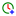
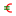
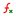
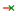

# Leit Icons

Generated on 2025-07-19T03:34:37.113Z

---

| Icon Name | SVG Path | Preview |
|-----------|----------|---------|
| align.center | [/icons/align/align-center.svg](./icons/align/align-center.svg) |  |
| align.horizontal.center | [/icons/align/align-horizontal-center.svg](./icons/align/align-horizontal-center.svg) |  |
| align.horizontal.left | [/icons/align/align-horizontal-left.svg](./icons/align/align-horizontal-left.svg) |  |
| align.horizontal.right | [/icons/align/align-horizontal-right.svg](./icons/align/align-horizontal-right.svg) |  |
| align.justify | [/icons/align/align-justify.svg](./icons/align/align-justify.svg) |  |
| align.left | [/icons/align/align-left.svg](./icons/align/align-left.svg) |  |
| align.right | [/icons/align/align-right.svg](./icons/align/align-right.svg) |  |
| align.vertical.bottom | [/icons/align/align-vertical-bottom.svg](./icons/align/align-vertical-bottom.svg) |  |
| align.vertical.center | [/icons/align/align-vertical-center.svg](./icons/align/align-vertical-center.svg) |  |
| align.vertical.top | [/icons/align/align-vertical-top.svg](./icons/align/align-vertical-top.svg) |  |
| alt | [/icons/alt.svg](./icons/alt.svg) |  |
| ampersand | [/icons/ampersand.svg](./icons/ampersand.svg) |  |
| arrow.both.nesw | [/icons/arrow/arrow-both-nesw.svg](./icons/arrow/arrow-both-nesw.svg) |  |
| arrow.both.nwse | [/icons/arrow/arrow-both-nwse.svg](./icons/arrow/arrow-both-nwse.svg) |  |
| arrow.both.x | [/icons/arrow/arrow-both-x.svg](./icons/arrow/arrow-both-x.svg) |  |
| arrow.both.y | [/icons/arrow/arrow-both-y.svg](./icons/arrow/arrow-both-y.svg) |  |
| arrow.down.2.line.from | [/icons/arrow/arrow-down-2-line-from.svg](./icons/arrow/arrow-down-2-line-from.svg) |  |
| arrow.down.2.line.to | [/icons/arrow/arrow-down-2-line-to.svg](./icons/arrow/arrow-down-2-line-to.svg) |  |
| arrow.down.2 | [/icons/arrow/arrow-down-2.svg](./icons/arrow/arrow-down-2.svg) |  |
| arrow.down.from.left | [/icons/arrow/arrow-down-from-left.svg](./icons/arrow/arrow-down-from-left.svg) |  |
| arrow.down.from.right | [/icons/arrow/arrow-down-from-right.svg](./icons/arrow/arrow-down-from-right.svg) |  |
| arrow.down.line.from | [/icons/arrow/arrow-down-line-from.svg](./icons/arrow/arrow-down-line-from.svg) |  |
| arrow.down.line.to | [/icons/arrow/arrow-down-line-to.svg](./icons/arrow/arrow-down-line-to.svg) |  |
| arrow.down.up.line.from | [/icons/arrow/arrow-down-up-line-from.svg](./icons/arrow/arrow-down-up-line-from.svg) |  |
| arrow.down.up.line.to | [/icons/arrow/arrow-down-up-line-to.svg](./icons/arrow/arrow-down-up-line-to.svg) |  |
| arrow.down.up | [/icons/arrow/arrow-down-up.svg](./icons/arrow/arrow-down-up.svg) |  |
| arrow.down | [/icons/arrow/arrow-down.svg](./icons/arrow/arrow-down.svg) |  |
| arrow.left.2.line.from | [/icons/arrow/arrow-left-2-line-from.svg](./icons/arrow/arrow-left-2-line-from.svg) |  |
| arrow.left.2.line.to | [/icons/arrow/arrow-left-2-line-to.svg](./icons/arrow/arrow-left-2-line-to.svg) |  |
| arrow.left.2 | [/icons/arrow/arrow-left-2.svg](./icons/arrow/arrow-left-2.svg) |  |
| arrow.left.curve | [/icons/arrow/arrow-left-curve.svg](./icons/arrow/arrow-left-curve.svg) |  |
| arrow.left.down | [/icons/arrow/arrow-left-down.svg](./icons/arrow/arrow-left-down.svg) |  |
| arrow.left.from.down | [/icons/arrow/arrow-left-from-down.svg](./icons/arrow/arrow-left-from-down.svg) |  |
| arrow.left.from.up | [/icons/arrow/arrow-left-from-up.svg](./icons/arrow/arrow-left-from-up.svg) |  |
| arrow.left.line.from | [/icons/arrow/arrow-left-line-from.svg](./icons/arrow/arrow-left-line-from.svg) |  |
| arrow.left.line.to | [/icons/arrow/arrow-left-line-to.svg](./icons/arrow/arrow-left-line-to.svg) |  |
| arrow.left.right.line.from | [/icons/arrow/arrow-left-right-line-from.svg](./icons/arrow/arrow-left-right-line-from.svg) |  |
| arrow.left.right.line.to | [/icons/arrow/arrow-left-right-line-to.svg](./icons/arrow/arrow-left-right-line-to.svg) |  |
| arrow.left.right | [/icons/arrow/arrow-left-right.svg](./icons/arrow/arrow-left-right.svg) |  |
| arrow.left.up | [/icons/arrow/arrow-left-up.svg](./icons/arrow/arrow-left-up.svg) |  |
| arrow.left | [/icons/arrow/arrow-left.svg](./icons/arrow/arrow-left.svg) |  |
| arrow.right.2.line.from | [/icons/arrow/arrow-right-2-line-from.svg](./icons/arrow/arrow-right-2-line-from.svg) |  |
| arrow.right.2.line.to | [/icons/arrow/arrow-right-2-line-to.svg](./icons/arrow/arrow-right-2-line-to.svg) |  |
| arrow.right.2 | [/icons/arrow/arrow-right-2.svg](./icons/arrow/arrow-right-2.svg) |  |
| arrow.right.curve | [/icons/arrow/arrow-right-curve.svg](./icons/arrow/arrow-right-curve.svg) |  |
| arrow.right.down | [/icons/arrow/arrow-right-down.svg](./icons/arrow/arrow-right-down.svg) |  |
| arrow.right.from.down | [/icons/arrow/arrow-right-from-down.svg](./icons/arrow/arrow-right-from-down.svg) |  |
| arrow.right.from.up | [/icons/arrow/arrow-right-from-up.svg](./icons/arrow/arrow-right-from-up.svg) |  |
| arrow.right.left.line.from | [/icons/arrow/arrow-right-left-line-from.svg](./icons/arrow/arrow-right-left-line-from.svg) |  |
| arrow.right.left.line.to | [/icons/arrow/arrow-right-left-line-to.svg](./icons/arrow/arrow-right-left-line-to.svg) |  |
| arrow.right.left | [/icons/arrow/arrow-right-left.svg](./icons/arrow/arrow-right-left.svg) |  |
| arrow.right.line.from | [/icons/arrow/arrow-right-line-from.svg](./icons/arrow/arrow-right-line-from.svg) |  |
| arrow.right.line.to | [/icons/arrow/arrow-right-line-to.svg](./icons/arrow/arrow-right-line-to.svg) |  |
| arrow.right.up | [/icons/arrow/arrow-right-up.svg](./icons/arrow/arrow-right-up.svg) |  |
| arrow.right | [/icons/arrow/arrow-right.svg](./icons/arrow/arrow-right.svg) |  |
| arrow.up.2.line.from | [/icons/arrow/arrow-up-2-line-from.svg](./icons/arrow/arrow-up-2-line-from.svg) |  |
| arrow.up.2.line.to | [/icons/arrow/arrow-up-2-line-to.svg](./icons/arrow/arrow-up-2-line-to.svg) |  |
| arrow.up.2 | [/icons/arrow/arrow-up-2.svg](./icons/arrow/arrow-up-2.svg) |  |
| arrow.up.down.line.from | [/icons/arrow/arrow-up-down-line-from.svg](./icons/arrow/arrow-up-down-line-from.svg) |  |
| arrow.up.down.line.to | [/icons/arrow/arrow-up-down-line-to.svg](./icons/arrow/arrow-up-down-line-to.svg) |  |
| arrow.up.down | [/icons/arrow/arrow-up-down.svg](./icons/arrow/arrow-up-down.svg) |  |
| arrow.up.from.left | [/icons/arrow/arrow-up-from-left.svg](./icons/arrow/arrow-up-from-left.svg) |  |
| arrow.up.from.right | [/icons/arrow/arrow-up-from-right.svg](./icons/arrow/arrow-up-from-right.svg) |  |
| arrow.up.line.from | [/icons/arrow/arrow-up-line-from.svg](./icons/arrow/arrow-up-line-from.svg) |  |
| arrow.up.line.to | [/icons/arrow/arrow-up-line-to.svg](./icons/arrow/arrow-up-line-to.svg) |  |
| arrow.up | [/icons/arrow/arrow-up.svg](./icons/arrow/arrow-up.svg) |  |
| asterisk.circle | [/icons/asterisk/asterisk-circle.svg](./icons/asterisk/asterisk-circle.svg) |  |
| asterisk.square | [/icons/asterisk/asterisk-square.svg](./icons/asterisk/asterisk-square.svg) |  |
| asterisk | [/icons/asterisk/asterisk.svg](./icons/asterisk/asterisk.svg) |  |
| at | [/icons/at.svg](./icons/at.svg) |  |
| barn | [/icons/barn.svg](./icons/barn.svg) |  |
| bluetooth.off | [/icons/bluetooth/bluetooth-off.svg](./icons/bluetooth/bluetooth-off.svg) |  |
| bluetooth | [/icons/bluetooth/bluetooth.svg](./icons/bluetooth/bluetooth.svg) |  |
| bold.emphasis | [/icons/bold/bold-emphasis.svg](./icons/bold/bold-emphasis.svg) |  |
| bold | [/icons/bold/bold.svg](./icons/bold/bold.svg) |  |
| book.a | [/icons/book/book-a.svg](./icons/book/book-a.svg) |  |
| book.minus | [/icons/book/book-minus.svg](./icons/book/book-minus.svg) |  |
| book.open | [/icons/book/book-open.svg](./icons/book/book-open.svg) |  |
| book.plus | [/icons/book/book-plus.svg](./icons/book/book-plus.svg) |  |
| book.text | [/icons/book/book-text.svg](./icons/book/book-text.svg) |  |
| book | [/icons/book/book.svg](./icons/book/book.svg) |  |
| bookmark.fill | [/icons/bookmark/bookmark-fill.svg](./icons/bookmark/bookmark-fill.svg) |  |
| bookmark.shade | [/icons/bookmark/bookmark-shade.svg](./icons/bookmark/bookmark-shade.svg) |  |
| bookmark | [/icons/bookmark/bookmark.svg](./icons/bookmark/bookmark.svg) |  |
| brackets.angle | [/icons/brackets/brackets-angle.svg](./icons/brackets/brackets-angle.svg) |  |
| brackets.square | [/icons/brackets/brackets-square.svg](./icons/brackets/brackets-square.svg) |  |
| brackets | [/icons/brackets/brackets.svg](./icons/brackets/brackets.svg) |  |
| calendar.empty | [/icons/calendar/calendar-empty.svg](./icons/calendar/calendar-empty.svg) |  |
| calendar.minus | [/icons/calendar/calendar-minus.svg](./icons/calendar/calendar-minus.svg) |  |
| calendar.plus | [/icons/calendar/calendar-plus.svg](./icons/calendar/calendar-plus.svg) |  |
| calendar.text.one | [/icons/calendar/calendar-text-one.svg](./icons/calendar/calendar-text-one.svg) |  |
| calendar.text | [/icons/calendar/calendar-text.svg](./icons/calendar/calendar-text.svg) |  |
| calendar | [/icons/calendar/calendar.svg](./icons/calendar/calendar.svg) |  |
| campfire | [/icons/campfire.svg](./icons/campfire.svg) |  |
| car.back | [/icons/car/car-back.svg](./icons/car/car-back.svg) |  |
| car.front | [/icons/car/car-front.svg](./icons/car/car-front.svg) |  |
| car | [/icons/car/car.svg](./icons/car/car.svg) |  |
| card | [/icons/card.svg](./icons/card.svg) |  |
| check.circle | [/icons/check/check-circle.svg](./icons/check/check-circle.svg) |  |
| check.square | [/icons/check/check-square.svg](./icons/check/check-square.svg) |  |
| check | [/icons/check/check.svg](./icons/check/check.svg) |  |
| chevron.down.2 | [/icons/chevron/chevron-down-2.svg](./icons/chevron/chevron-down-2.svg) |  |
| chevron.down.line.from | [/icons/chevron/chevron-down-line-from.svg](./icons/chevron/chevron-down-line-from.svg) |  |
| chevron.down.line.to | [/icons/chevron/chevron-down-line-to.svg](./icons/chevron/chevron-down-line-to.svg) |  |
| chevron.down | [/icons/chevron/chevron-down.svg](./icons/chevron/chevron-down.svg) |  |
| chevron.left.2 | [/icons/chevron/chevron-left-2.svg](./icons/chevron/chevron-left-2.svg) |  |
| chevron.left.line.from | [/icons/chevron/chevron-left-line-from.svg](./icons/chevron/chevron-left-line-from.svg) |  |
| chevron.left.line.to | [/icons/chevron/chevron-left-line-to.svg](./icons/chevron/chevron-left-line-to.svg) |  |
| chevron.left.line | [/icons/chevron/chevron-left-line.svg](./icons/chevron/chevron-left-line.svg) |  |
| chevron.left | [/icons/chevron/chevron-left.svg](./icons/chevron/chevron-left.svg) |  |
| chevron.right.2 | [/icons/chevron/chevron-right-2.svg](./icons/chevron/chevron-right-2.svg) |  |
| chevron.right.line.from | [/icons/chevron/chevron-right-line-from.svg](./icons/chevron/chevron-right-line-from.svg) |  |
| chevron.right.line.to | [/icons/chevron/chevron-right-line-to.svg](./icons/chevron/chevron-right-line-to.svg) |  |
| chevron.right.line | [/icons/chevron/chevron-right-line.svg](./icons/chevron/chevron-right-line.svg) |  |
| chevron.right | [/icons/chevron/chevron-right.svg](./icons/chevron/chevron-right.svg) |  |
| chevron.up.2 | [/icons/chevron/chevron-up-2.svg](./icons/chevron/chevron-up-2.svg) |  |
| chevron.up.line.from | [/icons/chevron/chevron-up-line-from.svg](./icons/chevron/chevron-up-line-from.svg) |  |
| chevron.up.line.to | [/icons/chevron/chevron-up-line-to.svg](./icons/chevron/chevron-up-line-to.svg) |  |
| chevron.up | [/icons/chevron/chevron-up.svg](./icons/chevron/chevron-up.svg) |  |
| chevrons.line | [/icons/chevrons/chevrons-line.svg](./icons/chevrons/chevrons-line.svg) |  |
| chevrons.outwards | [/icons/chevrons/chevrons-outwards.svg](./icons/chevrons/chevrons-outwards.svg) |  |
| chevrons | [/icons/chevrons/chevrons.svg](./icons/chevrons/chevrons.svg) |  |
| circle.fill | [/icons/circle/circle-fill.svg](./icons/circle/circle-fill.svg) |  |
| circle.shade | [/icons/circle/circle-shade.svg](./icons/circle/circle-shade.svg) |  |
| circle | [/icons/circle/circle.svg](./icons/circle/circle.svg) |  |
| clock.1 | [/icons/clock/clock-1.svg](./icons/clock/clock-1.svg) |  |
| clock.10 | [/icons/clock/clock-10.svg](./icons/clock/clock-10.svg) |  |
| clock.11 | [/icons/clock/clock-11.svg](./icons/clock/clock-11.svg) |  |
| clock.12 | [/icons/clock/clock-12.svg](./icons/clock/clock-12.svg) |  |
| clock.2 | [/icons/clock/clock-2.svg](./icons/clock/clock-2.svg) |  |
| clock.3 | [/icons/clock/clock-3.svg](./icons/clock/clock-3.svg) |  |
| clock.4 | [/icons/clock/clock-4.svg](./icons/clock/clock-4.svg) |  |
| clock.5 | [/icons/clock/clock-5.svg](./icons/clock/clock-5.svg) |  |
| clock.6 | [/icons/clock/clock-6.svg](./icons/clock/clock-6.svg) |  |
| clock.7 | [/icons/clock/clock-7.svg](./icons/clock/clock-7.svg) |  |
| clock.8 | [/icons/clock/clock-8.svg](./icons/clock/clock-8.svg) |  |
| clock.9 | [/icons/clock/clock-9.svg](./icons/clock/clock-9.svg) |  |
| clock.minus | [/icons/clock/clock-minus.svg](./icons/clock/clock-minus.svg) |  |
| clock.plus | [/icons/clock/clock-plus.svg](./icons/clock/clock-plus.svg) |  |
| clock | [/icons/clock/clock.svg](./icons/clock/clock.svg) |  |
| cloud.hail | [/icons/cloud/cloud-hail.svg](./icons/cloud/cloud-hail.svg) |  |
| cloud.rain | [/icons/cloud/cloud-rain.svg](./icons/cloud/cloud-rain.svg) |  |
| cloud.sun.hail | [/icons/cloud/cloud-sun-hail.svg](./icons/cloud/cloud-sun-hail.svg) |  |
| cloud.sun.rain | [/icons/cloud/cloud-sun-rain.svg](./icons/cloud/cloud-sun-rain.svg) |  |
| cloud.sun | [/icons/cloud/cloud-sun.svg](./icons/cloud/cloud-sun.svg) |  |
| cloud | [/icons/cloud/cloud.svg](./icons/cloud/cloud.svg) |  |
| code | [/icons/code.svg](./icons/code.svg) |  |
| cog | [/icons/cog.svg](./icons/cog.svg) |  |
| command | [/icons/command.svg](./icons/command.svg) |  |
| control | [/icons/control.svg](./icons/control.svg) |  |
| cpu | [/icons/cpu.svg](./icons/cpu.svg) |  |
| cube | [/icons/cube.svg](./icons/cube.svg) |  |
| currency.bitcoin | [/icons/currency/currency-bitcoin.svg](./icons/currency/currency-bitcoin.svg) |  |
| currency.cent | [/icons/currency/currency-cent.svg](./icons/currency/currency-cent.svg) |  |
| currency.euro | [/icons/currency/currency-euro.svg](./icons/currency/currency-euro.svg) |  |
| currency.sterling | [/icons/currency/currency-sterling.svg](./icons/currency/currency-sterling.svg) |  |
| currency.yen | [/icons/currency/currency-yen.svg](./icons/currency/currency-yen.svg) |  |
| currency | [/icons/currency/currency.svg](./icons/currency/currency.svg) |  |
| delta.capital | [/icons/delta/delta-capital.svg](./icons/delta/delta-capital.svg) |  |
| delta | [/icons/delta/delta.svg](./icons/delta/delta.svg) |  |
| derivative.partial | [/icons/derivative/derivative-partial.svg](./icons/derivative/derivative-partial.svg) |  |
| derivative.prime | [/icons/derivative/derivative-prime.svg](./icons/derivative/derivative-prime.svg) |  |
| derivative | [/icons/derivative/derivative.svg](./icons/derivative/derivative.svg) |  |
| diamond.fill | [/icons/diamond/diamond-fill.svg](./icons/diamond/diamond-fill.svg) |  |
| diamond.shade | [/icons/diamond/diamond-shade.svg](./icons/diamond/diamond-shade.svg) |  |
| diamond | [/icons/diamond/diamond.svg](./icons/diamond/diamond.svg) |  |
| discoball.2 | [/icons/discoball/discoball-2.svg](./icons/discoball/discoball-2.svg) |  |
| discoball | [/icons/discoball/discoball.svg](./icons/discoball/discoball.svg) |  |
| divide.circle | [/icons/divide/divide-circle.svg](./icons/divide/divide-circle.svg) |  |
| divide.square | [/icons/divide/divide-square.svg](./icons/divide/divide-square.svg) |  |
| divide | [/icons/divide/divide.svg](./icons/divide/divide.svg) |  |
| download | [/icons/download.svg](./icons/download.svg) |  |
| droplet.2 | [/icons/droplet/droplet-2.svg](./icons/droplet/droplet-2.svg) |  |
| droplet | [/icons/droplet/droplet.svg](./icons/droplet/droplet.svg) |  |
| easing.in | [/icons/easing/easing-in.svg](./icons/easing/easing-in.svg) |  |
| easing.inout | [/icons/easing/easing-inout.svg](./icons/easing/easing-inout.svg) |  |
| easing.linear | [/icons/easing/easing-linear.svg](./icons/easing/easing-linear.svg) |  |
| easing.out | [/icons/easing/easing-out.svg](./icons/easing/easing-out.svg) |  |
| epsilon | [/icons/epsilon.svg](./icons/epsilon.svg) |  |
| equal.approximately | [/icons/equal/equal-approximately.svg](./icons/equal/equal-approximately.svg) |  |
| equal.not | [/icons/equal/equal-not.svg](./icons/equal/equal-not.svg) |  |
| equal | [/icons/equal/equal.svg](./icons/equal/equal.svg) |  |
| exclamation.circle | [/icons/exclamation/exclamation-circle.svg](./icons/exclamation/exclamation-circle.svg) |  |
| exclamation.square | [/icons/exclamation/exclamation-square.svg](./icons/exclamation/exclamation-square.svg) |  |
| exclamation.triangle | [/icons/exclamation/exclamation-triangle.svg](./icons/exclamation/exclamation-triangle.svg) |  |
| exclamation | [/icons/exclamation/exclamation.svg](./icons/exclamation/exclamation.svg) |  |
| exponent.2 | [/icons/exponent/exponent-2.svg](./icons/exponent/exponent-2.svg) |  |
| exponent | [/icons/exponent/exponent.svg](./icons/exponent/exponent.svg) |  |
| eye.off | [/icons/eye/eye-off.svg](./icons/eye/eye-off.svg) |  |
| eye | [/icons/eye/eye.svg](./icons/eye/eye.svg) |  |
| file.a | [/icons/file/file-a.svg](./icons/file/file-a.svg) |  |
| file.minus | [/icons/file/file-minus.svg](./icons/file/file-minus.svg) |  |
| file.plus | [/icons/file/file-plus.svg](./icons/file/file-plus.svg) |  |
| file.text | [/icons/file/file-text.svg](./icons/file/file-text.svg) |  |
| file | [/icons/file/file.svg](./icons/file/file.svg) |  |
| fire | [/icons/fire.svg](./icons/fire.svg) |  |
| folder.a | [/icons/folder/folder-a.svg](./icons/folder/folder-a.svg) |  |
| folder.minus | [/icons/folder/folder-minus.svg](./icons/folder/folder-minus.svg) |  |
| folder.plus | [/icons/folder/folder-plus.svg](./icons/folder/folder-plus.svg) |  |
| folder.text | [/icons/folder/folder-text.svg](./icons/folder/folder-text.svg) |  |
| folder | [/icons/folder/folder.svg](./icons/folder/folder.svg) |  |
| function | [/icons/function.svg](./icons/function.svg) |  |
| gamma.capital | [/icons/gamma/gamma-capital.svg](./icons/gamma/gamma-capital.svg) |  |
| gamma | [/icons/gamma/gamma.svg](./icons/gamma/gamma.svg) |  |
| gear | [/icons/gear.svg](./icons/gear.svg) |  |
| globe | [/icons/globe.svg](./icons/globe.svg) |  |
| graph.exponential | [/icons/graph/graph-exponential.svg](./icons/graph/graph-exponential.svg) |  |
| graph.hyperbola | [/icons/graph/graph-hyperbola.svg](./icons/graph/graph-hyperbola.svg) |  |
| graph.linear | [/icons/graph/graph-linear.svg](./icons/graph/graph-linear.svg) |  |
| graph.parabola | [/icons/graph/graph-parabola.svg](./icons/graph/graph-parabola.svg) |  |
| graph.sqrt | [/icons/graph/graph-sqrt.svg](./icons/graph/graph-sqrt.svg) |  |
| graph | [/icons/graph/graph.svg](./icons/graph/graph.svg) |  |
| grid.2x2 | [/icons/grid/grid-2x2.svg](./icons/grid/grid-2x2.svg) |  |
| grid.3x3 | [/icons/grid/grid-3x3.svg](./icons/grid/grid-3x3.svg) |  |
| hash | [/icons/hash.svg](./icons/hash.svg) |  |
| heart.fill | [/icons/heart/heart-fill.svg](./icons/heart/heart-fill.svg) |  |
| heart.shade | [/icons/heart/heart-shade.svg](./icons/heart/heart-shade.svg) |  |
| heart | [/icons/heart/heart.svg](./icons/heart/heart.svg) |  |
| hexagon.fill | [/icons/hexagon/hexagon-fill.svg](./icons/hexagon/hexagon-fill.svg) |  |
| hexagon.shade | [/icons/hexagon/hexagon-shade.svg](./icons/hexagon/hexagon-shade.svg) |  |
| hexagon | [/icons/hexagon/hexagon.svg](./icons/hexagon/hexagon.svg) |  |
| home | [/icons/home.svg](./icons/home.svg) |  |
| hourglass | [/icons/hourglass.svg](./icons/hourglass.svg) |  |
| integral.2 | [/icons/integral/integral-2.svg](./icons/integral/integral-2.svg) |  |
| integral.contour | [/icons/integral/integral-contour.svg](./icons/integral/integral-contour.svg) |  |
| integral.definite | [/icons/integral/integral-definite.svg](./icons/integral/integral-definite.svg) |  |
| integral | [/icons/integral/integral.svg](./icons/integral/integral.svg) |  |
| italic | [/icons/italic.svg](./icons/italic.svg) |  |
| leaf | [/icons/leaf.svg](./icons/leaf.svg) |  |
| library | [/icons/library.svg](./icons/library.svg) |  |
| line.end.circle | [/icons/line/line-end-circle.svg](./icons/line/line-end-circle.svg) |  |
| line.end.diamond | [/icons/line/line-end-diamond.svg](./icons/line/line-end-diamond.svg) |  |
| line.end.square | [/icons/line/line-end-square.svg](./icons/line/line-end-square.svg) |  |
| line.end.x | [/icons/line/line-end-x.svg](./icons/line/line-end-x.svg) |  |
| line | [/icons/line/line.svg](./icons/line/line.svg) |  |
| link.couple | [/icons/link/link-couple.svg](./icons/link/link-couple.svg) |  |
| link.external | [/icons/link/link-external.svg](./icons/link/link-external.svg) |  |
| link | [/icons/link/link.svg](./icons/link/link.svg) |  |
| match | [/icons/match.svg](./icons/match.svg) |  |
| matrix.1x2 | [/icons/matrix/matrix-1x2.svg](./icons/matrix/matrix-1x2.svg) |  |
| matrix.2x2 | [/icons/matrix/matrix-2x2.svg](./icons/matrix/matrix-2x2.svg) |  |
| matrix | [/icons/matrix/matrix.svg](./icons/matrix/matrix.svg) |  |
| merge | [/icons/merge.svg](./icons/merge.svg) |  |
| message.round | [/icons/message/message-round.svg](./icons/message/message-round.svg) |  |
| message | [/icons/message/message.svg](./icons/message/message.svg) |  |
| microphone.off | [/icons/microphone/microphone-off.svg](./icons/microphone/microphone-off.svg) |  |
| microphone | [/icons/microphone/microphone.svg](./icons/microphone/microphone.svg) |  |
| minus.circle | [/icons/minus/minus-circle.svg](./icons/minus/minus-circle.svg) |  |
| minus.square | [/icons/minus/minus-square.svg](./icons/minus/minus-square.svg) |  |
| minus | [/icons/minus/minus.svg](./icons/minus/minus.svg) |  |
| more.circle | [/icons/more/more-circle.svg](./icons/more/more-circle.svg) |  |
| more.square | [/icons/more/more-square.svg](./icons/more/more-square.svg) |  |
| more.vertical.circle | [/icons/more/more-vertical-circle.svg](./icons/more/more-vertical-circle.svg) |  |
| more.vertical.square | [/icons/more/more-vertical-square.svg](./icons/more/more-vertical-square.svg) |  |
| more.vertical | [/icons/more/more-vertical.svg](./icons/more/more-vertical.svg) |  |
| more | [/icons/more/more.svg](./icons/more/more.svg) |  |
| numbersign | [/icons/numbersign.svg](./icons/numbersign.svg) |  |
| octagon.fill | [/icons/octagon/octagon-fill.svg](./icons/octagon/octagon-fill.svg) |  |
| octagon.shade | [/icons/octagon/octagon-shade.svg](./icons/octagon/octagon-shade.svg) |  |
| octagon | [/icons/octagon/octagon.svg](./icons/octagon/octagon.svg) |  |
| omega.capital | [/icons/omega/omega-capital.svg](./icons/omega/omega-capital.svg) |  |
| option | [/icons/option.svg](./icons/option.svg) |  |
| options.alt | [/icons/options/options-alt.svg](./icons/options/options-alt.svg) |  |
| options | [/icons/options/options.svg](./icons/options/options.svg) |  |
| paperplane.horizontal | [/icons/paperplane/paperplane-horizontal.svg](./icons/paperplane/paperplane-horizontal.svg) |  |
| paperplane | [/icons/paperplane/paperplane.svg](./icons/paperplane/paperplane.svg) |  |
| paragraph.rtl | [/icons/paragraph/paragraph-rtl.svg](./icons/paragraph/paragraph-rtl.svg) |  |
| paragraph | [/icons/paragraph/paragraph.svg](./icons/paragraph/paragraph.svg) |  |
| parens | [/icons/parens.svg](./icons/parens.svg) |  |
| pause | [/icons/pause.svg](./icons/pause.svg) |  |
| pen | [/icons/pen.svg](./icons/pen.svg) |  |
| pencil | [/icons/pencil.svg](./icons/pencil.svg) |  |
| pentagon.fill | [/icons/pentagon/pentagon-fill.svg](./icons/pentagon/pentagon-fill.svg) |  |
| pentagon.shade | [/icons/pentagon/pentagon-shade.svg](./icons/pentagon/pentagon-shade.svg) |  |
| pentagon | [/icons/pentagon/pentagon.svg](./icons/pentagon/pentagon.svg) |  |
| percent.circle | [/icons/percent/percent-circle.svg](./icons/percent/percent-circle.svg) |  |
| percent.square | [/icons/percent/percent-square.svg](./icons/percent/percent-square.svg) |  |
| percent | [/icons/percent/percent.svg](./icons/percent/percent.svg) |  |
| person.2 | [/icons/person/person-2.svg](./icons/person/person-2.svg) |  |
| person.circle | [/icons/person/person-circle.svg](./icons/person/person-circle.svg) |  |
| person.minus | [/icons/person/person-minus.svg](./icons/person/person-minus.svg) |  |
| person.more.vertical | [/icons/person/person-more-vertical.svg](./icons/person/person-more-vertical.svg) |  |
| person.more | [/icons/person/person-more.svg](./icons/person/person-more.svg) |  |
| person.plus | [/icons/person/person-plus.svg](./icons/person/person-plus.svg) |  |
| person | [/icons/person/person.svg](./icons/person/person.svg) |  |
| pi.capital | [/icons/pi/pi-capital.svg](./icons/pi/pi-capital.svg) |  |
| pi | [/icons/pi/pi.svg](./icons/pi/pi.svg) |  |
| picture | [/icons/picture.svg](./icons/picture.svg) |  |
| pilcrow | [/icons/pilcrow.svg](./icons/pilcrow.svg) |  |
| planet | [/icons/planet.svg](./icons/planet.svg) |  |
| play | [/icons/play.svg](./icons/play.svg) |  |
| plus.circle | [/icons/plus/plus-circle.svg](./icons/plus/plus-circle.svg) |  |
| plus.square | [/icons/plus/plus-square.svg](./icons/plus/plus-square.svg) |  |
| plus | [/icons/plus/plus.svg](./icons/plus/plus.svg) |  |
| recieve | [/icons/recieve.svg](./icons/recieve.svg) |  |
| rectangle.fill | [/icons/rectangle/rectangle-fill.svg](./icons/rectangle/rectangle-fill.svg) |  |
| rectangle.shade | [/icons/rectangle/rectangle-shade.svg](./icons/rectangle/rectangle-shade.svg) |  |
| rectangle.vertical.fill | [/icons/rectangle/rectangle-vertical-fill.svg](./icons/rectangle/rectangle-vertical-fill.svg) |  |
| rectangle.vertical.shade | [/icons/rectangle/rectangle-vertical-shade.svg](./icons/rectangle/rectangle-vertical-shade.svg) |  |
| rectangle.vertical | [/icons/rectangle/rectangle-vertical.svg](./icons/rectangle/rectangle-vertical.svg) |  |
| rectangle | [/icons/rectangle/rectangle.svg](./icons/rectangle/rectangle.svg) |  |
| regex | [/icons/regex.svg](./icons/regex.svg) |  |
| search | [/icons/search.svg](./icons/search.svg) |  |
| share | [/icons/share.svg](./icons/share.svg) |  |
| shift | [/icons/shift.svg](./icons/shift.svg) |  |
| sigma.capital | [/icons/sigma/sigma-capital.svg](./icons/sigma/sigma-capital.svg) |  |
| sigma | [/icons/sigma/sigma.svg](./icons/sigma/sigma.svg) |  |
| signal.high | [/icons/signal/signal-high.svg](./icons/signal/signal-high.svg) |  |
| signal.low | [/icons/signal/signal-low.svg](./icons/signal/signal-low.svg) |  |
| signal.medium | [/icons/signal/signal-medium.svg](./icons/signal/signal-medium.svg) |  |
| signal.zero | [/icons/signal/signal-zero.svg](./icons/signal/signal-zero.svg) |  |
| signal | [/icons/signal/signal.svg](./icons/signal/signal.svg) |  |
| slash.back.circle | [/icons/slash/slash-back-circle.svg](./icons/slash/slash-back-circle.svg) |  |
| slash.back.square | [/icons/slash/slash-back-square.svg](./icons/slash/slash-back-square.svg) |  |
| slash.back | [/icons/slash/slash-back.svg](./icons/slash/slash-back.svg) |  |
| slash.circle | [/icons/slash/slash-circle.svg](./icons/slash/slash-circle.svg) |  |
| slash.square | [/icons/slash/slash-square.svg](./icons/slash/slash-square.svg) |  |
| slash | [/icons/slash/slash.svg](./icons/slash/slash.svg) |  |
| space | [/icons/space.svg](./icons/space.svg) |  |
| sparkle.2 | [/icons/sparkle/sparkle-2.svg](./icons/sparkle/sparkle-2.svg) |  |
| sparkle.3 | [/icons/sparkle/sparkle-3.svg](./icons/sparkle/sparkle-3.svg) |  |
| sparkle | [/icons/sparkle/sparkle.svg](./icons/sparkle/sparkle.svg) |  |
| split | [/icons/split.svg](./icons/split.svg) |  |
| square.fill | [/icons/square/square-fill.svg](./icons/square/square-fill.svg) |  |
| square.shade | [/icons/square/square-shade.svg](./icons/square/square-shade.svg) |  |
| square | [/icons/square/square.svg](./icons/square/square.svg) |  |
| star.fill | [/icons/star/star-fill.svg](./icons/star/star-fill.svg) |  |
| star.shade | [/icons/star/star-shade.svg](./icons/star/star-shade.svg) |  |
| star | [/icons/star/star.svg](./icons/star/star.svg) |  |
| strikethrough | [/icons/strikethrough.svg](./icons/strikethrough.svg) |  |
| sun | [/icons/sun.svg](./icons/sun.svg) |  |
| tangent | [/icons/tangent.svg](./icons/tangent.svg) |  |
| textformat.size | [/icons/textformat/textformat-size.svg](./icons/textformat/textformat-size.svg) |  |
| textformat | [/icons/textformat/textformat.svg](./icons/textformat/textformat.svg) |  |
| tilde | [/icons/tilde.svg](./icons/tilde.svg) |  |
| tree.dead | [/icons/tree/tree-dead.svg](./icons/tree/tree-dead.svg) |  |
| tree.pine | [/icons/tree/tree-pine.svg](./icons/tree/tree-pine.svg) |  |
| tree | [/icons/tree/tree.svg](./icons/tree/tree.svg) |  |
| triangle.fill | [/icons/triangle/triangle-fill.svg](./icons/triangle/triangle-fill.svg) |  |
| triangle.right | [/icons/triangle/triangle-right.svg](./icons/triangle/triangle-right.svg) |  |
| triangle.shade | [/icons/triangle/triangle-shade.svg](./icons/triangle/triangle-shade.svg) |  |
| triangle | [/icons/triangle/triangle.svg](./icons/triangle/triangle.svg) |  |
| underline | [/icons/underline.svg](./icons/underline.svg) |  |
| upload | [/icons/upload.svg](./icons/upload.svg) |  |
| variable | [/icons/variable.svg](./icons/variable.svg) |  |
| wifi.low | [/icons/wifi/wifi-low.svg](./icons/wifi/wifi-low.svg) |  |
| wifi.medium | [/icons/wifi/wifi-medium.svg](./icons/wifi/wifi-medium.svg) |  |
| wifi.off | [/icons/wifi/wifi-off.svg](./icons/wifi/wifi-off.svg) |  |
| wifi | [/icons/wifi/wifi.svg](./icons/wifi/wifi.svg) |  |
| window.app | [/icons/window/window-app.svg](./icons/window/window-app.svg) |  |
| window.inset.half.left.bottom | [/icons/window/window-inset-half-left-bottom.svg](./icons/window/window-inset-half-left-bottom.svg) |  |
| window.inset.half.left.top | [/icons/window/window-inset-half-left-top.svg](./icons/window/window-inset-half-left-top.svg) |  |
| window.inset.half.left | [/icons/window/window-inset-half-left.svg](./icons/window/window-inset-half-left.svg) |  |
| window.inset.half.right.bottom | [/icons/window/window-inset-half-right-bottom.svg](./icons/window/window-inset-half-right-bottom.svg) |  |
| window.inset.half.right.top | [/icons/window/window-inset-half-right-top.svg](./icons/window/window-inset-half-right-top.svg) |  |
| window.inset.half.right | [/icons/window/window-inset-half-right.svg](./icons/window/window-inset-half-right.svg) |  |
| window.inset.third.center.bottom | [/icons/window/window-inset-third-center-bottom.svg](./icons/window/window-inset-third-center-bottom.svg) |  |
| window.inset.third.center.top | [/icons/window/window-inset-third-center-top.svg](./icons/window/window-inset-third-center-top.svg) |  |
| window.inset.third.center | [/icons/window/window-inset-third-center.svg](./icons/window/window-inset-third-center.svg) |  |
| window.inset.third.left.bottom | [/icons/window/window-inset-third-left-bottom.svg](./icons/window/window-inset-third-left-bottom.svg) |  |
| window.inset.third.left.top | [/icons/window/window-inset-third-left-top.svg](./icons/window/window-inset-third-left-top.svg) |  |
| window.inset.third.left | [/icons/window/window-inset-third-left.svg](./icons/window/window-inset-third-left.svg) |  |
| window.inset.third.right.bottom | [/icons/window/window-inset-third-right-bottom.svg](./icons/window/window-inset-third-right-bottom.svg) |  |
| window.inset.third.right.top | [/icons/window/window-inset-third-right-top.svg](./icons/window/window-inset-third-right-top.svg) |  |
| window.inset.third.right | [/icons/window/window-inset-third-right.svg](./icons/window/window-inset-third-right.svg) |  |
| window.inset | [/icons/window/window-inset.svg](./icons/window/window-inset.svg) |  |
| window.pictureinpicture | [/icons/window/window-pictureinpicture.svg](./icons/window/window-pictureinpicture.svg) |  |
| window.sidebar.boxes | [/icons/window/window-sidebar-boxes.svg](./icons/window/window-sidebar-boxes.svg) |  |
| window.sidebar.right.boxes | [/icons/window/window-sidebar-right-boxes.svg](./icons/window/window-sidebar-right-boxes.svg) |  |
| window.sidebar.right.text | [/icons/window/window-sidebar-right-text.svg](./icons/window/window-sidebar-right-text.svg) |  |
| window.sidebar.right | [/icons/window/window-sidebar-right.svg](./icons/window/window-sidebar-right.svg) |  |
| window.sidebar.text | [/icons/window/window-sidebar-text.svg](./icons/window/window-sidebar-text.svg) |  |
| window.sidebar | [/icons/window/window-sidebar.svg](./icons/window/window-sidebar.svg) |  |
| window | [/icons/window/window.svg](./icons/window/window.svg) |  |
| workflow | [/icons/workflow.svg](./icons/workflow.svg) |  |
| x.circle | [/icons/x/x-circle.svg](./icons/x/x-circle.svg) |  |
| x.square | [/icons/x/x-square.svg](./icons/x/x-square.svg) |  |
| x | [/icons/x/x.svg](./icons/x/x.svg) |  |
